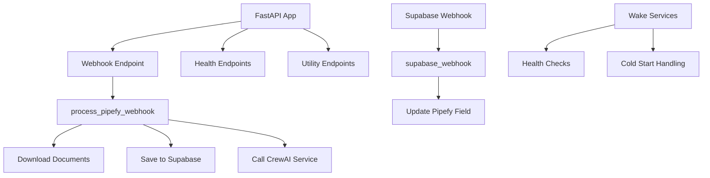
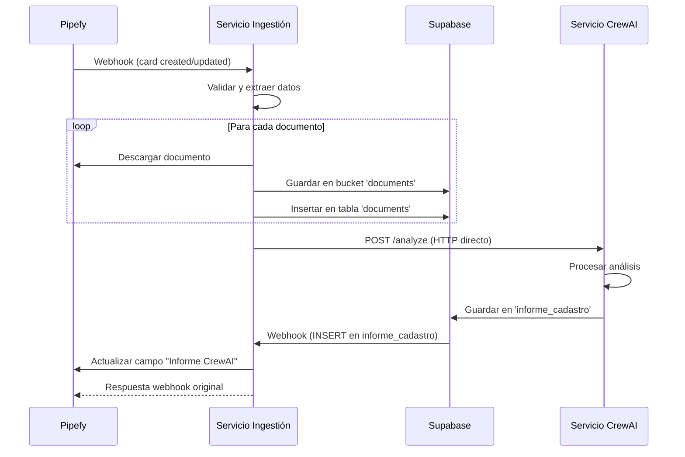

# 📥 Servicio de Ingestión de Documentos - Pipefy Integration

## 📋 Descripción General

El **Servicio de Ingestión de Documentos** es un microservicio especializado en la recepción, procesamiento y almacenamiento de documentos desde Pipefy. Actúa como el punto de entrada principal del sistema y orquesta el flujo completo de análisis de documentos.

### 🎯 Responsabilidades Principales

- **Recepción de Webhooks**: Procesa webhooks de Pipefy con información de cards
- **Descarga de Documentos**: Obtiene documentos desde URLs de Pipefy
- **Almacenamiento en Supabase**: Guarda documentos y metadatos en base de datos
- **Orquestación de Análisis**: Coordina llamadas al servicio CrewAI
- **Actualización de Pipefy**: Envía resultados de vuelta a Pipefy
- **Manejo de Cold Starts**: Gestiona servicios dormidos en Render

## 🏗️ Arquitectura del Servicio

### 📦 Componentes Principales



### 🔧 Tecnologías Utilizadas

- **FastAPI**: Framework web asíncrono
- **Supabase**: Base de datos y almacenamiento de archivos
- **HTTPX**: Cliente HTTP asíncrono para llamadas externas
- **Pipefy GraphQL API**: Integración con Pipefy
- **Event-Driven Architecture**: Webhooks para comunicación

## 🚀 Endpoints Disponibles

### 1. **POST /webhook** (Webhook Principal)
Recibe webhooks de Pipefy cuando se crean/actualizan cards.

**Request (Pipefy Webhook):**
```json
{
  "data": {
    "card": {
      "id": "123456789",
      "title": "Cadastro Empresa XYZ",
      "pipe": {
        "id": "306294445"
      },
      "fields": [
        {
          "name": "Documentos",
          "value": [
            {
              "name": "contrato.pdf",
              "url": "https://pipefy.s3.amazonaws.com/..."
            }
          ]
        }
      ]
    }
  }
}
```

**Response:**
```json
{
  "status": "success",
  "message": "Webhook procesado exitosamente",
  "card_id": "123456789",
  "documents_processed": 2,
  "crewai_analysis_initiated": true
}
```

### 2. **POST /supabase-webhook** (Webhook de Supabase)
Recibe notificaciones cuando se insertan nuevos análisis en `informe_cadastro`.

**Request (Supabase Webhook):**
```json
{
  "type": "INSERT",
  "table": "informe_cadastro",
  "record": {
    "case_id": "123456789",
    "informe": "Análisis completo...",
    "risk_score": "Médio"
  }
}
```

### 3. **GET /health**
Verifica estado del servicio y conectividad.

**Response:**
```json
{
  "status": "healthy",
  "service": "document_ingestion_service",
  "supabase_connected": true,
  "crewai_service_status": "healthy",
  "architecture": "modular_event_driven"
}
```

### 4. **POST /utils/wake-crewai**
Despierta el servicio CrewAI para evitar cold starts.

**Response:**
```json
{
  "status": "success",
  "crewai_status": "awake",
  "response_time": 1.2,
  "cold_start_detected": false
}
```

## 🔄 Flujo de Procesamiento Completo

### 📊 Diagrama de Flujo Principal



### 🎯 Flujo Detallado por Pasos

#### **Fase 1: Recepción de Webhook**
1. **Validación de Datos**
   - Verificar estructura del webhook
   - Extraer card_id y pipe_id
   - Validar presencia de documentos

2. **Extracción de Información**
   - Obtener lista de documentos
   - Identificar URLs de descarga
   - Generar case_id único

#### **Fase 2: Procesamiento de Documentos**
1. **Descarga de Documentos**
   - Descarga asíncrona desde Pipefy
   - Validación de tipos de archivo
   - Manejo de errores de descarga

2. **Almacenamiento en Supabase**
   - Upload a bucket 'documents'
   - Inserción en tabla 'documents'
   - Generación de URLs públicas

#### **Fase 3: Análisis CrewAI**
1. **Preparación de Request**
   - Obtener checklist desde Supabase
   - Estructurar datos para CrewAI
   - Configurar timeouts extendidos

2. **Llamada al Servicio CrewAI**
   - HTTP POST a `/analyze`
   - Manejo de cold starts (retry automático)
   - Timeout de 15 minutos

#### **Fase 4: Event-Driven Response**
1. **Webhook de Supabase**
   - Detección automática de INSERT
   - Extracción de informe generado
   - Preparación para actualización

2. **Actualización de Pipefy**
   - Búsqueda de field_id "Informe CrewAI"
   - Actualización usando GraphQL
   - Manejo de errores de API

## ⚡ Manejo de Cold Starts

### 🔧 Problema y Solución

**Problema**: Servicios en Render (plan gratuito) se "duermen" después de 15 minutos de inactividad.

**Soluciones Implementadas:**

1. **Timeout Extendido**
   ```python
   timeout = httpx.Timeout(900.0)  # 15 minutos
   ```

2. **Retry Automático para 502**
   ```python
   if response.status_code == 502:
       await asyncio.sleep(30)  # Esperar cold start
       response = await client.post(...)  # Reintentar
   ```

3. **Health Check Previo**
   ```python
   crewai_status = await check_crewai_service_health()
   if crewai_status["cold_start_detected"]:
       logger.info("🔥 Cold start detectado, esperando...")
   ```

4. **Endpoint de Wake-up**
   ```python
   @app.post("/utils/wake-crewai")
   async def wake_crewai_service():
       # Despierta el servicio CrewAI
   ```

### 📊 Métricas de Cold Start

- **Detección**: Automática via response time >5s
- **Recovery Time**: 30-60 segundos
- **Success Rate**: >95% después de retry
- **Monitoring**: Logs detallados de cold starts

## 💾 Integración con Supabase

### 🗄️ Estructura de Datos

**Tabla: `documents`**
```sql
CREATE TABLE documents (
  id UUID PRIMARY KEY DEFAULT gen_random_uuid(),
  case_id TEXT NOT NULL,
  pipe_id TEXT,
  card_id TEXT,
  document_name TEXT NOT NULL,
  document_tag TEXT,
  file_url TEXT NOT NULL,
  file_size BIGINT,
  file_type TEXT,
  created_at TIMESTAMPTZ DEFAULT NOW()
);
```

**Tabla: `informe_cadastro`**
```sql
CREATE TABLE informe_cadastro (
  id UUID PRIMARY KEY DEFAULT gen_random_uuid(),
  case_id TEXT NOT NULL,
  pipe_id TEXT,
  informe TEXT NOT NULL,
  risk_score TEXT,
  risk_score_numeric INTEGER,
  summary_report TEXT,
  status TEXT DEFAULT 'success',
  created_at TIMESTAMPTZ DEFAULT NOW()
);
```

**Buckets de Almacenamiento:**
- `documents`: Archivos de documentos procesados
- `checklist`: Documentos de checklist de validación

### 🔗 Configuración de Webhooks

**Webhook de Supabase:**
```sql
-- Trigger para tabla informe_cadastro
CREATE OR REPLACE FUNCTION notify_informe_insert()
RETURNS TRIGGER AS $$
BEGIN
  PERFORM net.http_post(
    url := 'https://your-service.onrender.com/supabase-webhook',
    headers := '{"Content-Type": "application/json"}'::jsonb,
    body := json_build_object(
      'type', 'INSERT',
      'table', 'informe_cadastro',
      'record', row_to_json(NEW)
    )::jsonb
  );
  RETURN NEW;
END;
$$ LANGUAGE plpgsql;

CREATE TRIGGER informe_cadastro_webhook
  AFTER INSERT ON informe_cadastro
  FOR EACH ROW
  EXECUTE FUNCTION notify_informe_insert();
```

## 🔗 Integración con Pipefy

### 📡 GraphQL API

**Obtener Información de Card:**
```graphql
query {
  card(id: "123456789") {
    id
    title
    pipe { id }
    fields {
      name
      value
      field {
        id
        label
        type
      }
    }
  }
}
```

**Actualizar Campo:**
```graphql
mutation {
  updateCardField(input: {
    card_id: "123456789"
    field_id: "informe_crewai_2"
    new_value: "Análisis completado..."
  }) {
    card {
      title
    }
  }
}
```

### 🔧 Configuración de Webhooks en Pipefy

1. **Acceder a Configuración del Pipe**
2. **Ir a "Webhooks"**
3. **Crear Nuevo Webhook:**
   - URL: `https://your-service.onrender.com/webhook`
   - Eventos: `card.create`, `card.update`
   - Headers: `Content-Type: application/json`

## 🔧 Configuración y Variables

### 📋 Variables de Entorno Requeridas

```bash
# Configuración del Servicio
PORT=8001

# Supabase
SUPABASE_URL=https://your-project.supabase.co
SUPABASE_KEY=your-anon-key

# Pipefy
PIPEFY_API_TOKEN=your-pipefy-token

# Servicios Externos
CREWAI_SERVICE_URL=https://pipefy-crewai-analysis-modular.onrender.com
```

### ⚙️ Configuración Opcional

```bash
# Timeouts
CREWAI_TIMEOUT=900  # 15 minutos
DOWNLOAD_TIMEOUT=60  # 1 minuto

# Cold Start Handling
COLD_START_RETRY_DELAY=30  # segundos
MAX_RETRIES=1

# Logging
LOG_LEVEL=INFO
```

## 🚨 Manejo de Errores

### 📊 Tipos de Error y Respuestas

1. **Error de Descarga de Documentos**
   ```python
   {
     "status": "partial_success",
     "message": "Algunos documentos no se pudieron descargar",
     "errors": ["Error descargando doc1.pdf: 404"]
   }
   ```

2. **Error de Servicio CrewAI**
   ```python
   {
     "status": "error",
     "message": "Error al llamar servicio CrewAI",
     "error_type": "cold_start_timeout"
   }
   ```

3. **Error de Actualización Pipefy**
   ```python
   {
     "status": "warning",
     "message": "Análisis completado pero error actualizando Pipefy",
     "pipefy_error": "Field not found"
   }
   ```

### 🔍 Debugging y Logs

**Logs Estructurados:**
```python
logger.info(f"📥 Webhook recibido - Card ID: {card_id}")
logger.info(f"📄 Procesando {len(documents)} documentos")
logger.info(f"🤖 Llamando servicio CrewAI para case_id: {case_id}")
logger.info(f"✅ Análisis completado - actualizando Pipefy")
```

**Niveles de Log:**
- `INFO`: Flujo normal
- `WARNING`: Problemas no críticos
- `ERROR`: Errores que requieren atención
- `DEBUG`: Información detallada para desarrollo

## 🧪 Testing y Validación

### 🔬 Endpoints de Prueba

```bash
# Health Check Completo
curl https://your-service.onrender.com/health

# Despertar Servicio CrewAI
curl -X POST https://your-service.onrender.com/utils/wake-crewai

# Simular Webhook de Pipefy
curl -X POST https://your-service.onrender.com/webhook \
  -H "Content-Type: application/json" \
  -d @test_webhook.json
```

### ✅ Validaciones Automáticas

- Conectividad a Supabase
- Estado del servicio CrewAI
- Validación de tokens de API
- Verificación de buckets de almacenamiento

## 📈 Monitoreo y Métricas

### 📊 KPIs del Servicio

- **Webhook Processing Time**: <5 segundos
- **Document Download Success**: >95%
- **CrewAI Call Success**: >90% (incluyendo retries)
- **Pipefy Update Success**: >95%
- **End-to-End Processing**: <20 minutos

### 🔍 Logs de Monitoreo

```json
{
  "timestamp": "2024-01-01T12:00:00Z",
  "event": "webhook_processed",
  "card_id": "123456789",
  "documents_count": 3,
  "processing_time": 4.2,
  "crewai_call_success": true,
  "cold_start_detected": false
}
```

## 🔄 Mantenimiento

### 🛠️ Tareas Regulares

1. **Monitoreo de Webhooks**
   - Verificar configuración en Pipefy
   - Validar URLs de endpoints

2. **Limpieza de Archivos**
   - Eliminar documentos antiguos de Supabase
   - Compresión de logs

3. **Verificación de Servicios**
   - Estado de servicio CrewAI
   - Conectividad a APIs externas

### 🚀 Deployment

**Render.com:**
```yaml
# render.yaml
services:
  - type: web
    name: pipefy-document-ingestion-modular
    env: python
    buildCommand: pip install -r requirements.txt
    startCommand: python app.py
    envVars:
      - key: PORT
        value: 8001
```

**Docker:**
```dockerfile
FROM python:3.11-slim
WORKDIR /app
COPY requirements.txt .
RUN pip install -r requirements.txt
COPY . .
EXPOSE 8001
CMD ["python", "app.py"]
```

## 🔧 Troubleshooting

### 🚨 Problemas Comunes

1. **Webhook No Recibido**
   - Verificar configuración en Pipefy
   - Comprobar URL del servicio
   - Revisar logs de Render

2. **Error 502 en CrewAI**
   - Cold start detectado
   - Usar endpoint `/utils/wake-crewai`
   - Esperar 30-60 segundos

3. **Campo No Actualizado en Pipefy**
   - Verificar que campo "Informe CrewAI" existe
   - Comprobar permisos de API token
   - Revisar logs de GraphQL

### 🔍 Comandos de Diagnóstico

```bash
# Verificar estado general
curl https://your-service.onrender.com/health

# Despertar servicios
curl -X POST https://your-service.onrender.com/utils/wake-crewai

# Ver logs en tiempo real (Render)
render logs --service your-service-name --follow
```

---

## 📞 Soporte y Contacto

Para soporte técnico:
- Revisar logs del servicio en Render
- Verificar configuración de webhooks en Pipefy
- Comprobar conectividad a Supabase
- Validar estado del servicio CrewAI

**Última Actualización**: Enero 2024
**Versión**: 1.0.0
**Arquitectura**: Modular Event-Driven 