# 📝 Rellenado Programático del Campo `informe_crewai_2` en Pipefy

## 📋 Descripción General

El campo `informe_crewai_2` es un campo personalizado de Pipefy que contiene el informe de análisis de documentos generado automáticamente por CrewAI. Este documento explica todo el proceso de rellenado programático de este campo, desde la configuración hasta la implementación.

---

## 🎯 Información del Campo

### Identificación del Campo
- **ID del Campo**: `informe_crewai_2`
- **Nombre Visual**: "Informe CrewAI"  
- **Tipo**: `long_text` (texto largo)
- **Descripción**: Informe generado automáticamente por CrewAI con análisis de documentos
- **Obligatorio**: No
- **Editable**: Sí

### Configuración Automática
```python
# Configuración centralizada en src/config/settings.py
FIELD_ID_INFORME: str = os.getenv("FIELD_ID_INFORME", "informe_crewai_2")
```

---

## 🔧 Arquitectura del Sistema

### 1. Flujo Completo de Rellenado

```mermaid
graph TD
    A[Webhook Pipefy] --> B[Descargar Documentos]
    B --> C[Subir a Supabase Storage]
    C --> D[Llamar Servicio CrewAI]
    D --> E[Recibir Análisis IA]
    E --> F[**Actualizar Campo informe_crewai_2**]
    F --> G[Mover Card por Clasificación]
```



### 2. Componentes Involucrados

#### **Servicio de Ingestión** (`pipefy-document-ingestion-v2`)
- Coordina todo el proceso
- Actualiza el campo en Pipefy
- Maneja errores y reintentos

#### **Servicio CrewAI** (`pipefy-crewai-analysis-v2`) 
- Genera el análisis de documentos
- Devuelve el informe estructurado
- Usa FAQ.pdf como conocimiento base

---

## 🛠️ Implementación Técnica

### 1. Función Principal de Actualización

```python
async def update_pipefy_informe_crewai_field(card_id: str, informe_content: str) -> bool:
    """
    Actualiza el campo 'Informe CrewAI' en Pipefy usando el field_id fijo descubierto.
    
    SOLUCIÓN DEFINITIVA:
    - Field ID fijo: "informe_crewai_2" (descubierto mediante query pipe.start_form_fields)
    - Sintaxis oficial: updateCardField con card_id, field_id, new_value
    - Sin búsquedas dinámicas ni creación de campos
    
    Args:
        card_id: ID del card de Pipefy
        informe_content: Contenido del informe a actualizar
    
    Returns:
        bool: True si la actualización fue exitosa, False en caso contrario
    """
```

#### **Características Técnicas**:
- **Field ID Fijo**: Usa `"informe_crewai_2"` directamente (no busca dinámicamente)
- **Sintaxis GraphQL**: Utiliza mutación `updateCardField` oficial de Pipefy
- **Escape de Contenido**: Maneja caracteres especiales para GraphQL
- **Logging Completo**: Registra cada paso del proceso

#### **Mutación GraphQL Utilizada**:
```graphql
mutation {
    updateCardField(input: {
        card_id: CARD_ID, 
        field_id: "informe_crewai_2", 
        new_value: "ESCAPED_CONTENT"
    }) {
        card {
            id
            title
        }
    }
}
```

### 2. Función de Detección Automática (Fallback)

```python
async def get_pipefy_field_id_for_informe_crewai(card_id: str) -> Optional[str]:
    """
    Detecta automáticamente el field_id del campo 'Informe CrewAI' en Pipefy.
    MEJORADO: Maneja el comportamiento específico de Pipefy donde los campos
    solo aparecen en la API cuando tienen algún valor asignado.
    """
```

#### **Estrategias de Búsqueda**:
1. **Búsqueda Exacta**: `"Informe CrewAI"`
2. **Búsqueda por Keywords**: `["informe crewai", "informe crew ai", "crewai informe"]`
3. **Manejo de Campos Vacíos**: Campos sin valor no aparecen en la API de Pipefy

### 3. Función de Creación Automática

```python
async def create_informe_crewai_field_in_phase(phase_id: str) -> Optional[str]:
    """
    Crea el campo 'Informe CrewAI' en una fase específica de Pipefy.
    """
```

#### **Configuración del Campo**:
- **Tipo**: `long_text`
- **Etiqueta**: `"Informe CrewAI"`
- **Descripción**: `"Informe generado automáticamente por CrewAI con análisis de documentos"`
- **Requerido**: `false`
- **Editable**: `true`

---

## 📤 Orquestación del Proceso

### 1. Función Orquestadora Principal

```python
async def handle_crewai_analysis_result(card_id: str, crew_response: Dict[str, Any]) -> Dict[str, Any]:
    """
    Orquestador principal que maneja los resultados del análisis CrewAI.
    """
```

### 2. Puntos de Actualización del Campo

#### **A. Actualización Principal** (Línea ~1600)
```python
# 1. Sempre atualizar o campo Informe CrewAI com o relatório detalhado
logger.info(f"📝 Atualizando campo 'Informe CrewAI' no card {card_id}")
informe_updated = await update_pipefy_informe_crewai_field(card_id, relatorio_detalhado)

if informe_updated:
    result["actions_executed"].append("informe_updated")
    logger.info(f"✅ Campo 'Informe CrewAI' atualizado com sucesso")
else:
    result["errors"].append("failed_to_update_informe")
    logger.error(f"❌ Falha ao atualizar campo 'Informe CrewAI'")
```

#### **B. Actualización de Aprobación** (Línea ~1777)
```python
# Atualizar campo con mensagem de aprovação
aprovacao_message = "✅ **DOCUMENTAÇÃO APROVADA**\n\nTodos os documentos estão em conformidade com o checklist. O caso seguirá para a próxima etapa de análise de risco."
informe_aprovacao = await update_pipefy_informe_crewai_field(card_id, aprovacao_message)
```

---

## 📊 Estructura del Contenido

### 1. Formato del Informe

El campo `informe_crewai_2` recibe contenido en **formato Markdown** con la siguiente estructura:

```markdown
# 📋 RELATÓRIO DE ANÁLISE DE DOCUMENTOS

## 📊 Resumo Executivo
- **Status Geral**: [Aprovado/Pendencia_Bloqueante/Pendencia_NaoBloqueante]
- **Total de Documentos**: X documentos analisados
- **Data da Análise**: YYYY-MM-DD HH:MM:SS

## 🏢 Informações da Empresa
- **Razão Social**: [Nome da empresa]
- **CNPJ**: [XX.XXX.XXX/XXXX-XX]

## 📋 Análise Detalhada

### ✅ Documentos Aprovados
[Lista de documentos que atendem aos critérios]

### ⚠️ Pendências Identificadas
[Lista de documentos/itens pendentes]

### 🔧 Ações Requeridas
[Lista de ações específicas necessárias]

## 🎯 Conclusão
[Resumo das próximas etapas]
```

### 2. Tipos de Status

#### **Status: "Aprovado"**
- Todos los documentos están conformes
- Card se mueve a fase "Aprovado" (ID: `338000018`)
- Mensaje de aprobación específico

#### **Status: "Pendencia_Bloqueante"**
- Documentos críticos faltantes
- Card se mueve a "Pendências Documentais" (ID: `338000017`)
- Envía notificación WhatsApp al gestor

#### **Status: "Pendencia_NaoBloqueante"**  
- Documentos menores pendientes
- Card se mueve a "Emitir documentos" (ID: `338000019`)
- Permite continuidad del proceso

---

## 🔄 Endpoints de Prueba y Debugging

### 1. Endpoints de Actualización Manual

#### **POST** `/test/update-pipefy-with-phase-handling`
```json
{
    "case_id": "CARD_ID",
    "informe_content": "Contenido del informe de prueba"
}
```

#### **POST** `/test/robust-field-handling`
```json
{
    "card_id": "CARD_ID",
    "test_content": "Contenido de prueba para el campo"
}
```

### 2. Endpoints de Detección

#### **GET** `/test/field-detection/{card_id}`
- Detecta si el campo existe en el card
- Devuelve información del field_id
- Útil para debugging

---

## 🔄 Integración con Otros Sistemas

### 1. Almacenamiento en Supabase

Además de actualizar Pipefy, el informe también se almacena en Supabase:

```python
# Tabla: informe_cadastro
{
    "case_id": "ID_DO_CARD",
    "informe": "CONTEUDO_MARKDOWN_COMPLETO",  # Mismo contenido que informe_crewai_2
    "risk_score": "ALTO|MEDIO|BAIXO",
    "analysis_details": { /* JSON estructurado */ },
    "documents_analyzed": 5,
    "status": "completed",
    "created_at": "2024-01-01T00:00:00Z"
}
```

### 2. Webhooks y Notificaciones

#### **Webhook de Supabase**: `/webhook/supabase/informe-created`
- Se dispara cuando se crea un registro en `informe_cadastro`
- Actualiza automáticamente el campo `informe_crewai_2`
- Maneja el procesamiento completo del workflow

---

## 🛡️ Manejo de Errores

### 1. Estrategias de Recuperación

#### **Error en Actualización**:
```python
try:
    informe_updated = await update_pipefy_informe_crewai_field(card_id, content)
    if not informe_updated:
        result["errors"].append("failed_to_update_informe")
        logger.error(f"❌ Falha ao atualizar campo 'Informe CrewAI'")
except Exception as e:
    logger.error(f"❌ Erro ao atualizar campo 'Informe CrewAI': {e}")
```

#### **Campo No Encontrado**:
- Log de debugging con campos disponibles
- Información de la fase actual del card
- Sugerencias para creación manual del campo

### 2. Logs de Debugging

```python
logger.info(f"🔄 Actualizando campo 'Informe CrewAI' para card: {card_id}")
logger.info(f"📝 Field ID fijo: informe_crewai_2")
logger.info(f"✅ Campo 'Informe CrewAI' atualizado com sucesso!")
logger.info(f"   - Card ID: {card_info.get('id')}")
logger.info(f"   - Card Title: {card_info.get('title')}")
logger.info(f"   - Conteúdo: {informe_content[:100]}...")
```

---

## 🧪 Testing

### 1. Tests Unitarios

Ubicación: `tests/unit/test_pipefy_functions.py`

```python
async def test_update_pipefy_informe_crewai_field_success():
    """Prueba actualización exitosa del campo informe_crewai_2"""
    
async def test_get_pipefy_field_id_for_informe_crewai():
    """Prueba detección automática del field_id"""
    
async def test_create_informe_crewai_field_in_phase():
    """Prueba creación automática del campo en una fase"""
```

### 2. Tests de Integración

```python
# Archivo: test_flujo_completo.py
# Verificar si el campo informe_crewai_2 fue actualizado
informe_field = next((f for f in fields if f.get('field', {}).get('id') == 'informe_crewai_2'), None)
if informe_field and informe_field.get('value'):
    print(f"✅ Campo 'informe_crewai_2' actualizado correctamente")
else:
    print(f"⚠️ Campo 'informe_crewai_2' no encontrado o vacío")
```

---

## 📚 Referencias y Configuración

### 1. Variables de Entorno

```bash
# .env
FIELD_ID_INFORME=informe_crewai_2
PIPEFY_TOKEN=your_pipefy_token_here
PHASE_ID_APROVADO=338000018
PHASE_ID_PENDENCIAS=338000017
PHASE_ID_EMITIR_DOCS=338000019
```

### 2. Endpoints del Servicio CrewAI

```bash
# Análisis de documentos
POST https://pipefy-crewai-analysis-modular.onrender.com/analyze
```

### 3. Fases de Pipefy

| Fase | ID | Descripción |
|------|----|----|
| Aprovado | `338000018` | Documentos conformes |
| Pendências Documentais | `338000017` | Pendencias bloqueantes |
| Emitir documentos | `338000019` | Pendencias no bloqueantes |
| Triagem | `338000020` | Fase inicial (webhook trigger) |

---

## 💡 Mejores Prácticas

### 1. **Field ID Fijo vs Detección Dinámica**
- ✅ **Usar**: Field ID fijo `"informe_crewai_2"`
- ❌ **Evitar**: Búsquedas dinámicas en cada actualización
- 📝 **Razón**: Mayor rendimiento y confiabilidad

### 2. **Escape de Contenido para GraphQL**
```python
escaped_content = informe_content.replace('"', '\\"').replace('\n', '\\n').replace('\r', '')
```

### 3. **Logging Estructurado**
- Usar emojis para categorización visual
- Incluir IDs de card y field para debugging
- Mostrar primeros 100 caracteres del contenido

### 4. **Manejo de Errores Graceful**
- No fallar toda la operación si el campo no se actualiza
- Log detallado para debugging
- Continuar con otras operaciones (movimiento de card, notificaciones)

---

## 🔄 Flujo de Datos Completo

```
1. 📥 WEBHOOK PIPEFY (Fase Triagem)
   ↓
2. 📎 DESCARGAR DOCUMENTOS
   ↓
3. ☁️ SUBIR A SUPABASE STORAGE  
   ↓
4. 🤖 ANÁLISIS CREWAI
   ↓
5. 📝 **ACTUALIZAR informe_crewai_2**
   ↓
6. 💾 GUARDAR EN SUPABASE DB
   ↓
7. 🔄 MOVER CARD SEGÚN CLASIFICACIÓN
   ↓
8. 📱 NOTIFICACIONES (si es necesario)
```

---

*Este documento cubre todos los aspectos técnicos del rellenado programático del campo `informe_crewai_2`. Para más detalles sobre otros componentes del sistema, consultar la documentación específica de cada módulo.* 